# ⚡ Instant Agent Notification Implementation

**Date:** 2026-01-11  
**Status:** ✅ Implemented

---

## 🎯 Objective
As per the user request:  
> "As soon as the Orchestrator detects the user's intent, I want the following actions to occur immediately... even before the AI response is completed"

The goal was to eliminate the latency between "understanding user intent" and "updating the UI".

---

## 🚀 Implementation Strategy
We moved the notification logic **upstream**, from "post-execution" to "pre-execution".

```mermaid
graph TD
    User[User Message] --> Orchestrator[Orchestrator Agent]
    Orchestrator -->|Classify Intent| Intent[Intent Detected]
    Intent -->|IMMEDIATE| Notify[⚡ EARLY NOTIFICATION]
    Notify -->|Parallel| Toast[Show Toast]
    Notify -->|Parallel| Dropdown[Update Dropdown]
    Intent -->|Start Processing| Agent[Agent Execution]
    Agent -->|Stream| Response[Streaming Response]
```

---

## 🛠️ Changes Breakdown

### 1. `lib/agents/orchestrator.ts`
- **Before:** Agent metadata was only returned at the end of the `chat()` method.
- **After:** Added an `onAgentDetermined` callback that is invoked immediately after intent classification (lines 404-413).

### 2. `app/api/agents/chat/route.ts`
- **Before:** Metadata was sent as the last chunk of the stream.
- **After:** Added a new SSE event type `agent_selected` which is sent as the **first** chunk of the stream (lines 35-38).

### 3. `lib/hooks/use-chat.ts`
- **Before:** Updated state only when `metadata` event arrived (end of stream).
- **After:** Listens for `agent_selected` event and triggers state updates immediately (lines 191-205).

### 4. `components/ai_chat/AIAssistantUI.jsx`
- **Before:** `handleAgentChange` only fired on final completion.
- **After:** `handleAgentChange` fires on start, updating both the `Header` dropdown and showing the toast simultaneously.

---

## ✅ Flow Verification

1. **User types:** "Create a BOM for a drone"
2. **Orchestrator:** Classifies as `BOM_GENERATOR` intent.
3. **API Route:** Immediately sends `data: {"type": "agent_selected", "agent": {"name": "BOM Generator", ...}}`
4. **Frontend:**
   - `Header` dropdown changes from "Conversational" to "BOM Generator".
   - Toast appears: "Agent Active: 📦 BOM Generator".
5. **Simultaneously:** The BOM Generator agent starts "thinking" and streaming the response.

---

## 🔍 How to Test
1. Open the chat.
2. Type a command that requires a specific agent (e.g., "Write firmware for blinking LED").
3. **Observe:** The header icon should change to `⚡ Code Generator` and the toast should appear **BEFORE** the first line of code is generated.
