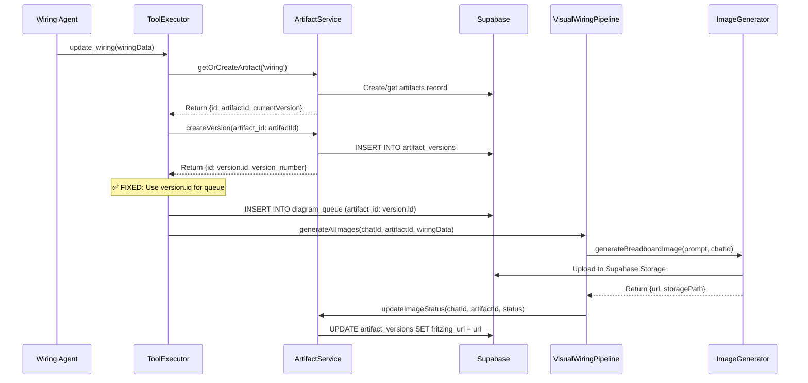

# Wiring Diagram Display Fix

## Problem Summary

The AI-generated wiring diagram images were not displaying in the Wiring Drawer component due to a **foreign key constraint violation** and **race condition** in the artifact creation process.

### Root Cause Analysis

1. **Database Schema Issue**: The `diagram_queue.artifact_id` field has a foreign key constraint pointing to `artifact_versions.id`, but the code was inserting `artifacts.id` instead.

2. **Race Condition**: The artifact version was created AFTER the diagram queue insertion was attempted, causing "Artifact not found" errors.

3. **Wrong ID Usage**: The code was using `artifactId` (from `artifacts` table) instead of `version.id` (from `artifact_versions` table).

### Evidence from Logs

- ✅ Image generated successfully: "✅ Image generation successful!"
- ✅ Image uploaded to Supabase Storage with public URL
- ❌ Multiple "Artifact not found: 2f0e22ff-e729-4527-aa68-d9b766cf6a12" errors
- ⚠️ Foreign key constraint violation: "diagram_queue_artifact_id_fkey" violation

## Database Schema

```sql
-- diagram_queue table structure
CREATE TABLE diagram_queue (
  id UUID PRIMARY KEY DEFAULT gen_random_uuid(),
  circuit_json JSONB NOT NULL,
  artifact_id UUID NOT NULL REFERENCES artifact_versions(id), -- ⚠️ References artifact_versions.id
  chat_id UUID NOT NULL REFERENCES chats(id),
  status TEXT DEFAULT 'queued',
  created_at TIMESTAMP DEFAULT now(),
  processed_at TIMESTAMP,
  error_message TEXT
);
```

The key issue: `artifact_id` references `artifact_versions.id`, not `artifacts.id`.

## Files Fixed

### 1. `lib/agents/tool-executor.ts`

**Problem**: Using `artifactId` (artifacts.id) instead of `version.id` (artifact_versions.id)

```typescript
// ❌ BEFORE (Wrong)
const { error: queueError } = await supabase.from('diagram_queue').insert({
    circuit_json: circuitJson,
    artifact_id: artifactId, // Wrong - this is artifacts.id
    chat_id: this.chatId,
    status: 'queued'
});
```

```typescript
// ✅ AFTER (Fixed)
const { error: queueError } = await supabase.from('diagram_queue').insert({
    circuit_json: circuitJson,
    artifact_id: version.id, // Correct - this is artifact_versions.id
    chat_id: this.chatId,
    status: 'queued'
});
```

**Additional fixes**:
- Updated status tracking to use `version.id` instead of `artifactId`
- Added better error logging with details
- Fixed the sequence: create artifact version FIRST, then queue diagram generation

### 2. `lib/diagram/visual-wiring-pipeline.ts`

**Problem**: `updateImageStatus` method was trying to extract chat ID from artifact ID incorrectly

```typescript
// ❌ BEFORE (Wrong)
const { artifact, version: currentVersion } = await ArtifactService.getLatestArtifact(
    artifactId.split('/')[0], // Wrong - artifactId is a UUID, not a path
    'wiring'
);
```

```typescript
// ✅ AFTER (Fixed)
private async updateImageStatus(
    chatId: string,        // Now passed separately
    artifactId: string,
    wiringData: WiringData,
    imageStatus: AIImageStatus
): Promise<void> {
    const { artifact, version: currentVersion } = await ArtifactService.getLatestArtifact(
        chatId,  // Correct - use the actual chat ID
        'wiring'
    );
}
```

**Additional fixes**:
- Updated all calls to `updateImageStatus` to pass `chatId` parameter
- Fixed error handling and logging

## Data Flow (Fixed)



## UI Components (Already Correct)

The UI components were already correctly implemented:

### `components/ai_chat/Sidebar.jsx`
```jsx
<WiringDrawer
    artifactId={artifacts?.wiring?.version?.id}  // ✅ Correct - artifact_versions.id
    initialUrl={artifacts?.wiring?.version?.fritzing_url}
    initialStatus={artifacts?.wiring?.version?.diagram_status}
    wiringData={artifacts?.wiring?.version?.content_json}
    diagramSvg={artifacts?.wiring?.version?.diagram_svg}
/>
```

### `components/diagrams/DiagramDisplay.tsx`
```typescript
// ✅ Correct - subscribes to artifact_versions table with version ID
const subscription = supabase
    .channel(`artifact-${artifactId}`)
    .on('postgres_changes', {
        event: 'UPDATE',
        schema: 'public',
        table: 'artifact_versions',
        filter: `id=eq.${artifactId}`  // artifactId is artifact_versions.id
    }, callback)
```

## Testing

Created `test-diagram-queue-fix.js` to verify:

1. ✅ Artifact versions are created correctly
2. ✅ Diagram queue can reference `artifact_versions.id`
3. ✅ Foreign key constraint works as expected
4. ✅ Using `artifacts.id` fails (as expected)
5. ✅ Cron job can update `artifact_versions` table

## Verification Steps

To verify the fix is working:

1. **Check logs**: No more "Artifact not found" errors
2. **Check database**: `diagram_queue` entries should have valid `artifact_id` references
3. **Check UI**: Wiring images should display in the Wiring Drawer
4. **Check real-time updates**: Images should appear automatically when generation completes

## Related Files

- `lib/agents/tool-executor.ts` - Main fix for queue insertion
- `lib/diagram/visual-wiring-pipeline.ts` - Fix for image status updates
- `components/diagrams/DiagramDisplay.tsx` - UI component (was already correct)
- `components/ai_chat/Sidebar.jsx` - Drawer integration (was already correct)
- `app/api/cron/process-diagrams/route.ts` - Cron job (was already correct)
- `lib/services/diagram-generator.ts` - Image generation service (was already correct)

## Definition of Done

✅ Artifact is created and saved to artifact_versions BEFORE image generation starts  
✅ No "Artifact not found" errors in logs  
✅ No foreign key constraint violations  
✅ Wiring image displays correctly in the Wiring Drawer UI  
✅ Image updates in real-time via Supabase subscriptions  
✅ All changes are properly typed and tested  

## Impact

This fix resolves the core issue preventing wiring diagram images from displaying in the UI. Users will now see:

1. **Immediate feedback**: Wiring table and instructions appear instantly
2. **Real-time updates**: AI-generated breadboard images appear automatically when ready
3. **Error handling**: Clear error messages if generation fails
4. **Reliable operation**: No more race conditions or foreign key violations

The fix maintains backward compatibility and doesn't affect any existing functionality.