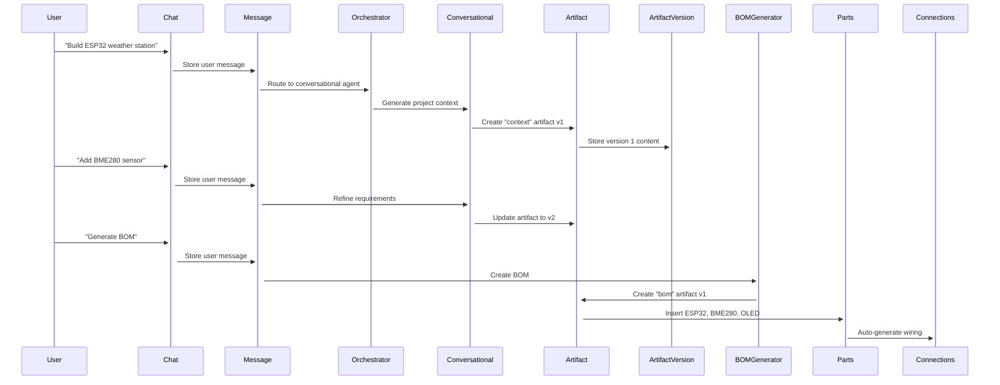

# 🗄️ OHM Database Architecture

> **Goal**: Replicate Claude/ChatGPT-style conversation storage using **ONLY Supabase (PostgreSQL)**

---

## 📋 Table of Contents

1. [Overview](#overview)
2. [Core Tables](#core-tables)
3. [Data Flow](#data-flow)
4. [Unique Chat URLs](#unique-chat-urls)
5. [Artifact Versioning](#artifact-versioning)
6. [Multi-Agent Tracking](#multi-agent-tracking)
7. [Sharing & Collaboration](#sharing--collaboration)
8. [Performance & Scaling](#performance--scaling)
9. [Storage Strategy](#storage-strategy)
10. [API Integration](#api-integration)

---

## 🎯 Overview

### What We're Building

A database architecture that supports:

✅ **Unique URLs for each chat** (like `ohm.app/chat/550e8400-...`)  
✅ **Full conversation history** with multi-agent tracking  
✅ **Versioned artifacts** (code, BOM, wiring with git-like history)  
✅ **File uploads** (circuit images, datasheets)  
✅ **Public sharing** (share chats with unique tokens)  
✅ **Full-text search** across all conversations  
✅ **Real-time updates** (using Supabase Realtime)  
✅ **Scalable to millions of users**  

### Technology Stack

- **Database**: PostgreSQL (via Supabase)
- **Search**: PostgreSQL Full-Text Search (tsvector)
- **File Storage**: Supabase Storage (S3-compatible)
- **Auth**: Supabase Auth
- **Real-time**: Supabase Realtime (WebSocket)

---

## 🗂️ Core Tables

### 1. **Chats** - The Conversation Container

```
chats/
├── id (UUID) ← Unique URL identifier
├── user_id
├── title (auto-generated from first message)
├── project_id (optional link to project)
├── current_phase (ideation → parts → assembly → code)
├── is_public, share_token
└── metadata (JSONB for flexibility)
```

**Key Features**:
- Every chat gets a unique UUID for URL routing
- Can exist independently OR be linked to a project
- Tracks workflow phase (where user is in the process)
- Public sharing via `share_token`

**URL Structure**: `https://ohm.app/chat/{chat_id}`

---

### 2. **Messages** - All Conversation History

```
messages/
├── id (UUID)
├── chat_id (references chats)
├── sequence_number (for precise ordering)
├── role (user, assistant, system)
├── content (the actual message)
├── agent_name (orchestrator, conversational, bomGenerator)
├── agent_model (openai/gpt-4o, anthropic/claude-opus-4-5)
├── intent (CHAT, BOM, CODE, WIRING)
├── input_tokens, output_tokens
├── created_artifact_ids[] (links to artifacts)
└── content_search (tsvector for full-text search)
```

**Key Features**:
- Every message tracks which agent/model generated it
- Full-text search enabled on `content_search`
- Links to artifacts created by this message
- Token usage tracking for cost analysis

---

### 3. **Artifacts** - Versioned Outputs

```
artifacts/
├── id (UUID)
├── chat_id, project_id
├── type (context, mvp, prd, bom, code, wiring, circuit_diagram)
├── title, description
├── current_version, total_versions
└── created_by_message_id
```

**Types of Artifacts**:
- `context` - Project Context Document
- `mvp` - MVP Specification
- `prd` - Product Requirements Document
- `bom` - Bill of Materials
- `code` - Generated code files
- `wiring` - Wiring instructions
- `circuit_diagram` - Visual diagrams
- `budget` - Budget analysis
- `datasheet_analysis` - Parsed datasheets
- `overview` - Project overview

---

### 4. **Artifact Versions** - Git-Style History

```
artifact_versions/
├── id (UUID)
├── artifact_id
├── version_number (1, 2, 3...)
├── content (text for code, markdown)
├── content_json (JSONB for structured data like BOM)
├── file_url (for binary files)
├── change_summary (what changed)
├── parent_version_id (links to previous version)
└── created_by_message_id
```

**Example Flow**:
1. User: "Create a BOM for ESP32 weather station"
2. Agent creates artifact (BOM) with version 1
3. User: "Replace DHT22 with BME280"
4. Agent creates version 2 linked to version 1
5. User can view entire version history

---

### 5. **Projects** - Hardware Specifications

```
projects/
├── id (UUID)
├── name, description, category
├── goal, location, target_budget
├── current_step, workflow_steps
├── status (draft, active, completed)
├── total_parts, total_connections
└── metadata (JSONB)
```

**Relationship**:
- One project can have multiple chats (iterations, revisions)
- Each chat can create/update artifacts for the project

---

### 6. **Parts** - BOM Components

```
parts/
├── id (UUID)
├── project_id, artifact_id (links to BOM artifact)
├── name, part_number, manufacturer
├── quantity, voltage, current, interface_type
├── price, supplier, supplier_url
├── specs (JSONB for flexible technical data)
├── alternatives (JSONB array)
└── compatibility_warnings[]
```

**Smart Features**:
- Linked to specific BOM artifact version
- Stores alternatives for budget optimization
- Compatibility warnings (voltage mismatches, etc.)

---

### 7. **Connections** - Wiring Diagrams

```
connections/
├── id (UUID)
├── project_id, artifact_id
├── sequence_number (step-by-step order)
├── from_part_id, from_pin, from_pin_type
├── to_part_id, to_pin, to_pin_type
├── voltage, signal_type, wire_color
└── warnings[]
```

**Features**:
- Precise pin-to-pin mapping
- Wire color coding
- Voltage level tracking
- Step-by-step assembly instructions

---

### 8. **Code Files** - Generated Firmware

```
code_files/
├── id (UUID)
├── project_id, artifact_id
├── filename, language, platform
├── content (the actual code)
├── unit_number (Success Units: 1, 2, 3)
├── required_libraries[]
└── is_production_ready
```

**Success Unit Methodology**:
- Unit 1: Calibration script
- Unit 2: Minimal working code
- Unit 3: Full implementation with features

---

### 9. **Attachments** - User Uploads

```
attachments/
├── id (UUID)
├── chat_id, message_id
├── filename, file_type, file_size
├── storage_bucket, storage_path
├── category (circuit_image, datasheet, reference_image)
└── is_processed, processing_status
```

**Supabase Storage Integration**:
- Files stored in Supabase Storage buckets
- Public URLs generated for images
- Processed for AI analysis (circuit verification, datasheet parsing)

---

### 10. **Activity Log** - Event Tracking

```
activity_log/
├── id (UUID)
├── user_id, chat_id, project_id
├── event_type (chat_created, artifact_generated, etc.)
├── event_data (JSONB)
└── timestamp
```

**Use Cases**:
- Analytics (which agents are used most)
- Debugging (trace user actions)
- Notifications (future feature)

---

## 🔄 Data Flow: From Chat to Artifacts

### Example: Creating a Weather Station



### Database Operations

1. **New Chat Created**:
   ```sql
   INSERT INTO chats (user_id, title) VALUES (...);
   -- Auto-generates UUID for URL
   ```

2. **User Sends Message**:
   ```sql
   INSERT INTO messages (chat_id, role, content, sequence_number)
   VALUES (chat_id, 'user', 'Build weather station', 1);
   
   -- Trigger updates chat.last_message_at automatically
   ```

3. **Agent Responds**:
   ```sql
   INSERT INTO messages (
     chat_id, role, content, sequence_number,
     agent_name, agent_model, intent
   ) VALUES (
     chat_id, 'assistant', '...response...', 2,
     'conversational', 'anthropic/claude-opus-4-5', 'CHAT'
   );
   ```

4. **Artifact Created**:
   ```sql
   -- Using helper function
   SELECT create_artifact_with_version(
     chat_id,
     project_id,
     'bom',
     'Weather Station BOM',
     NULL, -- no text content
     '{"components": [...]}', -- JSON content
     message_id
   );
   ```

5. **Parts Added**:
   ```sql
   INSERT INTO parts (project_id, artifact_id, name, price, voltage, ...)
   VALUES 
     (proj_id, artifact_id, 'ESP32-DevKitC', 12.99, '3.3V', ...),
     (proj_id, artifact_id, 'BME280', 7.99, '3.3V', ...);
   ```

---

## 🔗 Unique Chat URLs

### How It Works

Every chat gets a **UUID v4** identifier:
```
550e8400-e29b-41d4-a716-446655440000
```

**URL Structure**:
```
https://ohm.app/chat/550e8400-e29b-41d4-a716-446655440000
```

### Next.js Route

```typescript
// app/chat/[id]/page.tsx
export default async function ChatPage({ 
  params 
}: { 
  params: { id: string } 
}) {
  const { data: chat } = await supabase
    .from('chats')
    .select(`
      *,
      messages (*),
      artifacts (*),
      project:projects (*)
    `)
    .eq('id', params.id)
    .single();

  return <ChatInterface chat={chat} />;
}
```

### Sharing URLs

For public sharing, we add a **share_token**:
```
https://ohm.app/share/abc123xyz
```

```sql
-- Create share link
INSERT INTO shared_chats (chat_id, share_token)
VALUES (chat_id, 'abc123xyz');

UPDATE chats SET is_public = true WHERE id = chat_id;
```

---

## 🎨 Artifact Versioning (Git-Style)

### Version History

```
BOM Artifact v1 (Initial)
├── ESP32-DevKitC
├── DHT22
└── 0.96" OLED

        ↓ User: "Replace DHT22 with BME280"

BOM Artifact v2
├── ESP32-DevKitC
├── BME280 ← Changed
└── 0.96" OLED
```

### Querying Versions

```sql
-- Get all versions of an artifact
SELECT * FROM artifact_versions
WHERE artifact_id = 'xxx'
ORDER BY version_number ASC;

-- Get current version
SELECT av.* FROM artifacts a
JOIN artifact_versions av ON av.artifact_id = a.id
WHERE a.id = 'xxx' AND av.version_number = a.current_version;

-- Compare versions
SELECT 
  v1.content as old_content,
  v2.content as new_content,
  v2.change_summary
FROM artifact_versions v1, artifact_versions v2
WHERE v1.artifact_id = 'xxx' AND v1.version_number = 1
  AND v2.artifact_id = 'xxx' AND v2.version_number = 2;
```

### Creating New Version

```sql
-- Update artifact to point to new version
UPDATE artifacts 
SET current_version = 2, total_versions = 2
WHERE id = artifact_id;

-- Insert new version
INSERT INTO artifact_versions (
  artifact_id,
  version_number,
  content_json,
  change_summary,
  parent_version_id,
  created_by_message_id
) VALUES (
  artifact_id,
  2,
  '{"components": [...]}'::jsonb,
  'Replaced DHT22 with BME280 for better accuracy',
  previous_version_id,
  message_id
);
```

---

## 🤖 Multi-Agent Tracking

### Every Message Tracks Agent Metadata

```typescript
interface Message {
  id: string;
  chat_id: string;
  role: 'user' | 'assistant' | 'system';
  content: string;
  
  // Multi-agent tracking
  agent_name: 'orchestrator' | 'conversational' | 'bomGenerator' | ...;
  agent_model: 'openai/gpt-4o' | 'anthropic/claude-opus-4-5';
  agent_icon: '🎯' | '💡' | '📦';
  intent: 'CHAT' | 'BOM' | 'CODE' | 'WIRING';
  
  // Cost tracking
  input_tokens: number;
  output_tokens: number;
}
```

### Analytics Queries

```sql
-- Which agent is used most?
SELECT 
  agent_name,
  COUNT(*) as message_count,
  SUM(input_tokens + output_tokens) as total_tokens
FROM messages
WHERE role = 'assistant'
GROUP BY agent_name
ORDER BY message_count DESC;

-- Average tokens per agent
SELECT 
  agent_name,
  AVG(output_tokens) as avg_response_length
FROM messages
WHERE role = 'assistant'
GROUP BY agent_name;

-- Cost per chat
SELECT 
  chat_id,
  SUM(input_tokens) as total_input,
  SUM(output_tokens) as total_output,
  -- Calculate cost (example: $0.01 per 1K tokens)
  (SUM(input_tokens + output_tokens) / 1000.0) * 0.01 as estimated_cost
FROM messages
GROUP BY chat_id;
```

---

## 🔒 Sharing & Collaboration

### Public Sharing

```sql
-- Make chat public and generate share link
INSERT INTO shared_chats (chat_id, share_token)
VALUES (
  'chat-uuid',
  encode(gen_random_bytes(16), 'hex') -- Random token
);

UPDATE chats 
SET is_public = true, share_token = 'generated-token'
WHERE id = 'chat-uuid';
```

### Forking Shared Chats

```sql
-- User clicks "Fork this chat"
-- 1. Copy chat
INSERT INTO chats (user_id, title, description)
SELECT 
  'new-user-id',
  'Forked: ' || title,
  description
FROM chats
WHERE id = 'original-chat-id';

-- 2. Copy all messages
INSERT INTO messages (chat_id, role, content, agent_name, ...)
SELECT 
  'new-chat-id',
  role,
  content,
  agent_name,
  ...
FROM messages
WHERE chat_id = 'original-chat-id';

-- 3. Track fork
INSERT INTO chat_forks (original_chat_id, forked_chat_id, user_id)
VALUES ('original-chat-id', 'new-chat-id', 'new-user-id');
```

### Row-Level Security

```sql
-- Users can only see:
-- 1. Their own chats
-- 2. Public chats
-- 3. Shared chats

CREATE POLICY "Users can view accessible chats" ON chats
  FOR SELECT USING (
    auth.uid() = user_id 
    OR is_public = true 
    OR id IN (SELECT chat_id FROM shared_chats)
  );
```

---

## ⚡ Performance & Scaling

### Indexing Strategy

```sql
-- Most common queries:
-- 1. Get recent chats for a user
CREATE INDEX idx_chats_user_recent 
ON chats(user_id, last_message_at DESC);

-- 2. Get messages for a chat (ordered)
CREATE INDEX idx_messages_chat_sequence 
ON messages(chat_id, sequence_number);

-- 3. Full-text search in messages
CREATE INDEX idx_messages_search 
ON messages USING gin(content_search);

-- 4. Get artifacts for a chat
CREATE INDEX idx_artifacts_chat 
ON artifacts(chat_id) 
WHERE is_visible = true;
```

### Query Optimization

```sql
-- BAD: This loads ALL messages then filters
SELECT * FROM messages WHERE chat_id = 'xxx';

-- GOOD: Use LIMIT for pagination
SELECT * FROM messages 
WHERE chat_id = 'xxx' 
ORDER BY sequence_number DESC 
LIMIT 50 OFFSET 0;

-- BETTER: Use cursor-based pagination
SELECT * FROM messages 
WHERE chat_id = 'xxx' 
  AND sequence_number > last_seen_sequence
ORDER BY sequence_number ASC 
LIMIT 50;
```

### Caching Strategy

**Levels of Caching**:

1. **Browser**: Cache recent messages in IndexedDB
2. **CDN**: Cache public shared chats at edge
3. **Redis** (future): Cache hot chats in memory
4. **PostgreSQL**: Built-in query cache

---

## 💾 Storage Strategy

### File Organization

```
Supabase Storage Buckets:
├── attachments/           (User uploads)
│   ├── {user_id}/
│   │   ├── {chat_id}/
│   │   │   ├── circuit_photo_1.jpg
│   │   │   └── datasheet.pdf
│
├── circuit_verifications/ (AI analysis results)
│   ├── {chat_id}/
│   │   └── verified_{timestamp}.json
│
├── exports/              (Project exports)
│   ├── {project_id}/
│   │   ├── bom.csv
│   │   ├── wiring.pdf
│   │   └── code.zip
```

### Storage Policies

```sql
-- Users can upload to their own folder
CREATE POLICY "Users can upload own files"
ON storage.objects FOR INSERT
WITH CHECK (
  bucket_id = 'attachments' 
  AND (storage.foldername(name))[1] = auth.uid()::text
);

-- Public read for shared chats
CREATE POLICY "Public read for shared files"
ON storage.objects FOR SELECT
USING (
  bucket_id = 'attachments' 
  AND ... -- Check if associated chat is public
);
```

---

## 🔌 API Integration

### TypeScript Client

```typescript
import { createClient } from '@supabase/supabase-js';

const supabase = createClient(
  process.env.NEXT_PUBLIC_SUPABASE_URL!,
  process.env.NEXT_PUBLIC_SUPABASE_ANON_KEY!
);

// Auto-generated types from schema
import type { Database } from './types/supabase';

type Chat = Database['public']['Tables']['chats']['Row'];
type Message = Database['public']['Tables']['messages']['Row'];
```

### Example: Load Chat with All Data

```typescript
async function loadChat(chatId: string) {
  const { data, error } = await supabase
    .from('chats')
    .select(`
      *,
      messages (
        *,
        agent_name,
        agent_model
      ),
      artifacts (
        id,
        type,
        title,
        current_version,
        artifact_versions!inner (
          version_number,
          content,
          content_json
        )
      ),
      project:projects (
        *,
        parts (*),
        connections (*)
      )
    `)
    .eq('id', chatId)
    .eq('artifacts.artifact_versions.version_number', 
        supabase.raw('artifacts.current_version'))
    .single();

  return data;
}
```

### Real-time Subscriptions

```typescript
// Listen for new messages in a chat
const subscription = supabase
  .channel(`chat:${chatId}`)
  .on(
    'postgres_changes',
    {
      event: 'INSERT',
      schema: 'public',
      table: 'messages',
      filter: `chat_id=eq.${chatId}`
    },
    (payload) => {
      console.log('New message:', payload.new);
      // Update UI with new message
    }
  )
  .subscribe();
```

---

## 📊 Scalability Considerations

### Current Architecture Handles:

- **✅ 1M+ users**: Row-level security ensures data isolation
- **✅ 100M+ messages**: PostgreSQL can handle billions of rows with proper indexing
- **✅ Fast queries**: Indexes on foreign keys and frequently queried columns
- **✅ Full-text search**: PostgreSQL tsvector is production-ready
- **✅ File storage**: Supabase Storage is S3-compatible, infinitely scalable

### Future Optimizations (if needed):

1. **Partitioning**: Partition `messages` table by month
   ```sql
   CREATE TABLE messages_2026_01 PARTITION OF messages
   FOR VALUES FROM ('2026-01-01') TO ('2026-02-01');
   ```

2. **Read Replicas**: Offload read queries to replicas (Supabase Pro)

3. **Archiving**: Move old chats to cold storage after 1 year

4. **CDN Caching**: Cache frequently accessed public chats

---

## 🎯 Key Takeaways

✅ **Every chat has a unique URL** via UUID primary key  
✅ **Full conversation history** with multi-agent tracking  
✅ **Git-style artifact versioning** for all outputs  
✅ **Public sharing** with unique tokens  
✅ **Full-text search** across all messages  
✅ **File uploads** with AI processing  
✅ **Scalable to millions** of users with proper indexing  
✅ **All using PostgreSQL** - no need for multiple databases  

**We've achieved Claude/ChatGPT-style storage using ONLY Supabase!** 🚀

---

## 📚 Next Steps

1. ✅ Schema created
2. ⏭️ Set up Supabase project
3. ⏭️ Run migrations
4. ⏭️ Configure Row-Level Security
5. ⏭️ Generate TypeScript types
6. ⏭️ Build API routes
7. ⏭️ Integrate with multi-agent system
8. ⏭️ Build UI components

Ready to start implementing? 🛠️
